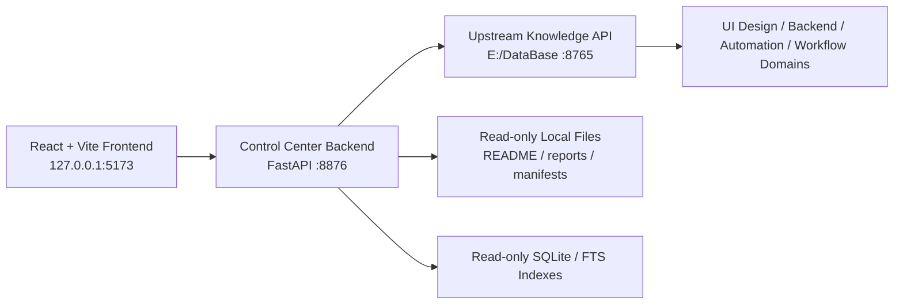

# Personal AI Database Control Center

## Overview

Personal AI Database Control Center is a full-stack dashboard for browsing, searching, and generating task briefs from a local personal AI knowledge database.

个人 AI 知识库检索与管理控制台，用于查看本地知识库状态、搜索多领域知识、浏览报告，并为 Codex / opencode / Claude Code 等 AI Agent 生成任务 Brief 和 Handoff 上下文。

This is an independent local-first project. It is not the `E:\DataBase` repository itself.

## Status

- Version: V1.6 Release Polish
- Current state: Stable local full-stack demo
- Backend: FastAPI
- Frontend: React + Vite
- Data source: `E:\DataBase` local knowledge database
- Mode: Read-only by default

## Features

- Multi-domain knowledge dashboard
- Domain status inspection
- Backend knowledge search
- Search ranking optimization
- Knowledge detail viewer
- Backend rules / templates / reports browsing
- Report viewer
- Brief generator for AI coding agents
- Agent Handoff Markdown export
- Copy / Download handoff context
- Safe read-only integration with `E:\DataBase`
- Upstream API proxy to `http://127.0.0.1:8765`

## Screenshots

Screenshots are stored in [`docs/screenshots`](docs/screenshots).

### Dashboard


### Domains


### Search


### Backend Knowledge


### Reports


### Brief


### Search Detail Viewer

Screenshots can be added after running the V1.4+ frontend locally.

### Handoff Export

Screenshots can be added after running the V1.5+ frontend locally.

## Architecture



The frontend only calls this project's backend. The control center backend first proxies the local `E:\DataBase` API when it is available. When needed, it reads manifests, reports, and SQLite indexes in read-only mode. It does not write to `E:\DataBase` and does not rebuild indexes.

## Tech Stack

Backend:

- Python
- FastAPI
- Pydantic
- SQLite read-only access
- urllib/http client
- pathlib / json / logging

Frontend:

- React
- Vite
- CSS
- Fetch API

Database source:

- `E:\DataBase`
- local API `http://127.0.0.1:8765`
- SQLite / FTS / BM25 indexes

## Quick Start

This local demo uses three services.

### 1. Start the upstream knowledge API

```powershell
cd E:\DataBase\backend_api
.\.venv\Scripts\python.exe -m uvicorn app.main:app --host 127.0.0.1 --port 8765 --reload
```

### 2. Start the Control Center backend

If the backend virtual environment does not exist yet:

```powershell
cd E:\Projects\personal-ai-db-control-center\backend
python -m venv .venv
.\.venv\Scripts\python.exe -m pip install -r requirements.txt
```

Start the backend:

```powershell
cd E:\Projects\personal-ai-db-control-center\backend
.\.venv\Scripts\python.exe -m uvicorn app.main:app --host 127.0.0.1 --port 8876 --reload
```

### 3. Start the frontend

```powershell
cd E:\Projects\personal-ai-db-control-center\frontend
npm install
npm run dev
```

Open:

```text
http://127.0.0.1:5173
```

The frontend API base defaults to:

```text
http://127.0.0.1:8876
```

Set `VITE_API_BASE` only when the backend runs on a different address.

## Backend API Endpoints

All project endpoints return a unified response shape with `ok`, `data`, `error`, and `request_id`.

- `GET /health`
- `GET /domains`
- `GET /domains/{domain}/status`
- `GET /search`
- `POST /brief`
- `GET /reports`
- `GET /reports/{domain}/{report_name}`
- `GET /backend/files`
- `GET /backend/chunks/{chunk_id}`

See [`docs/API.md`](docs/API.md) for endpoint details and examples.

## Frontend Pages

- **Dashboard**: database root status, upstream API status, backend chunk counts, domain overview, and recent report counts.
- **Domains**: allowed knowledge domains, available sources, operations, and domain status details.
- **Search**: domain-aware search with ranking optimization, usage hints, knowledge detail viewer, and handoff export.
- **Backend Knowledge**: browser for backend rules, topics, patterns, checklists, templates, references, and reports.
- **Reports**: generated report list with scrollable markdown report preview.
- **Brief**: task prompt, retrieval limits, returned chunks, final handoff, folded debug output, and Agent Handoff Markdown export.

## Agent Handoff Export

V1.5 added handoff export for AI coding workflows:

- Search can export ranked knowledge results as Markdown.
- Brief can export an Agent Task Brief.
- Exports can be copied for Codex / opencode / Claude Code.
- Exports can be downloaded as `.md` files.
- Export generation happens in the browser and does not write to `E:\DataBase`.

## How It Uses `E:\DataBase`

The project uses `E:\DataBase` as a read-only knowledge source:

- Calls the upstream API at `http://127.0.0.1:8765` for health, backend search, and brief generation.
- Reads domain metadata, rules, reports, README files, and manifests through allowlisted paths.
- Reads backend chunks from SQLite / FTS indexes using read-only connections.
- Falls back to local files and read-only SQLite query when the upstream API is unavailable.
- Does not copy database files into this project.

## Safety Boundaries

- This project is independent from `E:\DataBase`.
- It does not modify `E:\DataBase`.
- It does not modify `E:\DataBase\backend_api`.
- It does not modify `E:\DataBase\runtime\db`.
- It does not rebuild indexes.
- It does not clear SQLite tables.
- It is read-only by default.
- It should not store secrets.
- `.env.example` must only contain placeholders.
- It does not provide delete, write, reindex, or migration endpoints.

## Validation

Recent validation commands:

```powershell
python -m py_compile backend\app\main.py
python scripts\validate_project.py
cd frontend
npm run build
cd ..
git diff --check
```

Current verification status is tracked in [`PROJECT_REPORT.md`](PROJECT_REPORT.md).

## Project Structure

```text
personal-ai-db-control-center/
  backend/
    app/
      core/
      routers/
      schemas/
      services/
    requirements.txt
    README.md
  frontend/
    src/
      components/
      pages/
      utils/
      api.js
      styles.css
    package.json
    README.md
  docs/
    API.md
    screenshots/
  scripts/
    validate_project.py
  PROJECT_REPORT.md
  RELEASE_NOTES.md
  TASK_MEMORY.md
  README.md
```

## Roadmap

- **V1.1:** UI refinement and UX fixes completed
- **V1.2:** GitHub presentation polish completed
- **V1.3:** Search ranking optimization completed
- **V1.4:** Knowledge detail viewer completed
- **V1.5:** Agent Handoff Markdown export completed
- **V1.6:** Release polish and presentation cleanup
- **V1.7:** Optional prompt pack templates for Codex / opencode / Claude Code
- **V1.8:** Optional read-only analytics dashboard
- **V2.0:** Optional token authentication and controlled write workflows

## Resume Description

中文：

基于 FastAPI 与 React 构建个人 AI 知识库检索与管理控制台，实现多领域知识库状态监控、统一搜索、搜索排序优化、知识详情查看、报告浏览、任务 Brief 生成和 Agent Handoff Markdown 导出，为 Codex、opencode、Claude Code 等 AI Agent 提供结构化上下文支持。

English:

A full-stack dashboard built with FastAPI and React for managing a local personal AI knowledge database, supporting domain inspection, ranked knowledge search, detail viewing, report browsing, task brief generation, and Agent Handoff Markdown export for AI coding agents.

## Notes

- This is a local-first developer tool.
- It is designed for personal AI-assisted development workflows.
- It requires a local `E:\DataBase` instance to use all features.
- No real secrets, private keys, JWT secrets, database passwords, or production credentials should be committed.
