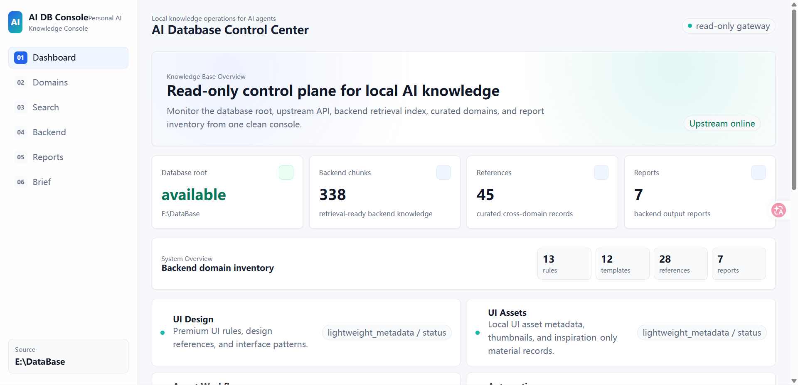
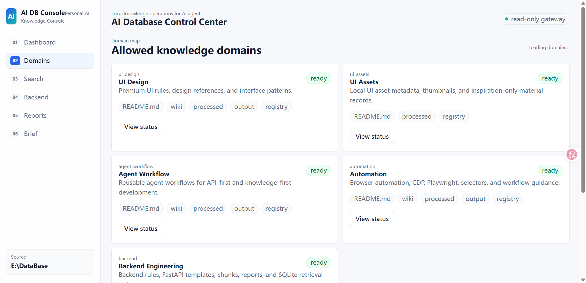
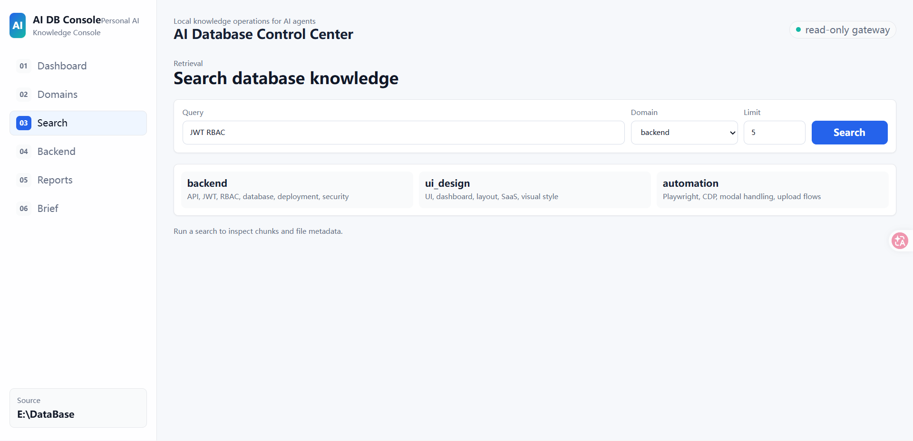
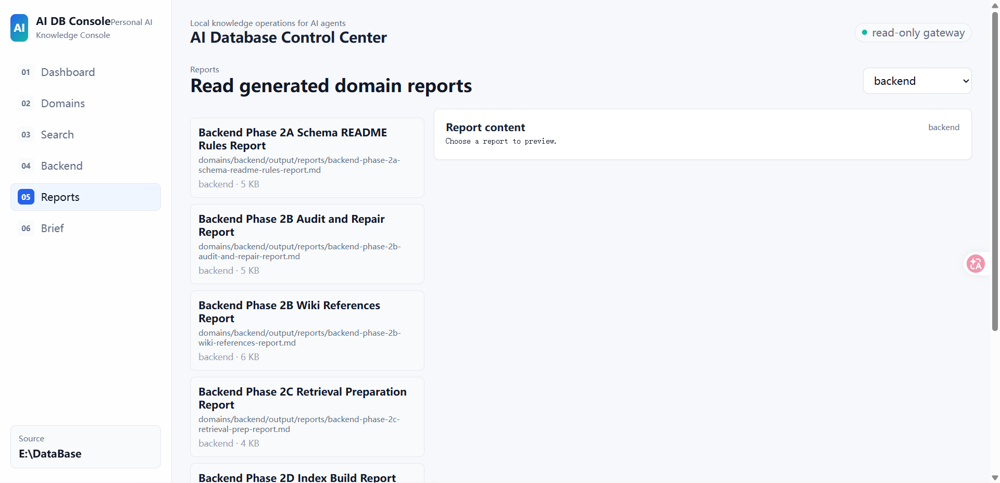
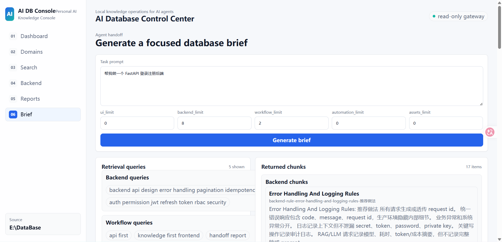
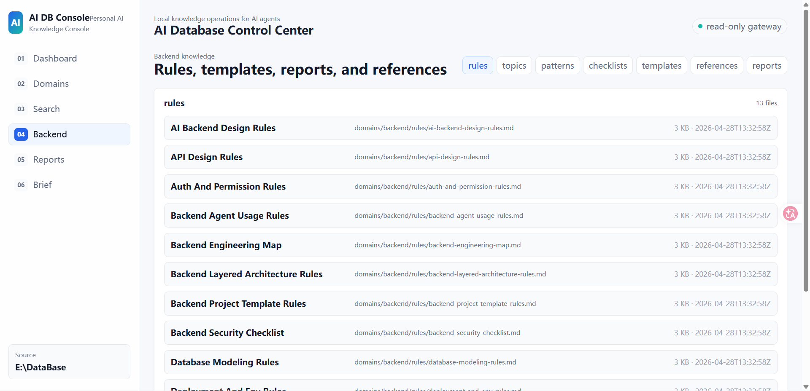

# Personal AI Database Control Center

An independent fullstack control center for browsing and querying a local personal AI knowledge database at `E:\DataBase`.

This repository is **not** the `E:\DataBase` database repository itself. It is a separate application that reads from `E:\DataBase` and from the existing local knowledge API when available.

## Project Overview

Personal AI Database Control Center provides a read-only web console for local AI knowledge operations:

- Inspect database health and domain status.
- Search backend/UI/workflow/automation knowledge.
- Browse backend rules, templates, checklists, references, and reports.
- Generate agent handoff briefs through the upstream database API.
- Review V1.1 UI state through committed screenshots.

The project lives at:

```text
E:\Projects\personal-ai-db-control-center
```

The source knowledge database lives at:

```text
E:\DataBase
```

## Features

- **Read-only FastAPI backend** wrapping local API calls, safe filesystem metadata, reports, and backend SQLite chunk lookup.
- **React + Vite frontend** with a light SaaS-style console UI.
- **Domain dashboard** for `backend`, `ui_design`, `ui_assets`, `agent_workflow`, and `automation`.
- **Search page** with domain usage hints and friendly empty states.
- **Backend knowledge browser** for rules, topics, patterns, checklists, templates, references, and reports.
- **Reports reader** with a report list and scrollable content panel.
- **Brief page** that separates retrieval queries, returned chunks, final handoff, and folded debug JSON.
- **Validation script** for backend import and route-level acceptance checks.

## Screenshots

V1.1 UI review screenshots are stored under [`docs/screenshots`](docs/screenshots).

### Dashboard



### Domains



### Search



### Backend Knowledge



### Reports



### Brief



## Architecture

```text
frontend React console
  -> project FastAPI backend
    -> upstream local API at http://127.0.0.1:8765
    -> read-only files under E:\DataBase
    -> read-only backend SQLite index under E:\DataBase\runtime\db\sqlite\backend
```

Directory layout:

```text
personal-ai-db-control-center/
  backend/
    app/
      core/
      routers/
      schemas/
      services/
    requirements.txt
  frontend/
    src/
      components/
      pages/
      api.js
      styles.css
  docs/
    API.md
    screenshots/
  scripts/
    validate_project.py
  PROJECT_REPORT.md
  TASK_MEMORY.md
```

## Tech Stack

Backend:

- Python
- FastAPI
- Pydantic
- `pathlib`
- `sqlite3` read-only connections
- `urllib.request` for upstream API calls

Frontend:

- React
- Vite
- Native CSS
- Fetch API

Tooling:

- `npm run build`
- `python scripts/validate_project.py`
- `git diff --check`

## Quick Start

### 1. Start the upstream database API

This project can read local files when needed, but `/brief` works best when the existing database API is running:

```powershell
cd E:\DataBase\backend_api
python -m uvicorn app.main:app --host 127.0.0.1 --port 8765
```

### 2. Start the backend

```powershell
cd E:\Projects\personal-ai-db-control-center\backend
python -m venv .venv
.\.venv\Scripts\pip install -r requirements.txt
.\.venv\Scripts\python -m uvicorn app.main:app --host 127.0.0.1 --port 8876
```

### 3. Start the frontend

```powershell
cd E:\Projects\personal-ai-db-control-center\frontend
npm install
npm run dev
```

The frontend defaults to:

```text
http://127.0.0.1:5173
```

The frontend API base defaults to:

```text
http://127.0.0.1:8876
```

Override it with `VITE_API_BASE` if needed.

### 4. Validate the project

```powershell
cd E:\Projects\personal-ai-db-control-center
python scripts\validate_project.py
cd frontend
npm run build
```

## Backend API Endpoints

All project endpoints return the same response shape:

```json
{
  "ok": true,
  "data": {},
  "error": null,
  "request_id": ""
}
```

Implemented endpoints:

- `GET /health`
- `GET /domains`
- `GET /domains/{domain}/status`
- `GET /search?domain=backend&q=JWT%20RBAC&limit=5`
- `POST /brief`
- `GET /reports?domain=backend`
- `GET /reports/{domain}/{report_name}`
- `GET /backend/files?type=rules`
- `GET /backend/chunks/{chunk_id}`

See [`docs/API.md`](docs/API.md) for the API reference.

## Frontend Pages

- **Dashboard**: database root status, upstream API status, backend chunk counts, domain overview, recent reports.
- **Domains**: allowed domains, available sources, operations, and domain status details.
- **Search**: domain-aware search with usage hints for backend, UI design, and automation queries.
- **Backend Knowledge**: browser for backend rules, topics, patterns, checklists, templates, references, and reports.
- **Reports**: report list and scrollable report reader.
- **Brief**: task prompt, retrieval limits, returned chunks, final handoff, and folded debug output.

## How It Uses `E:\DataBase`

The project uses `E:\DataBase` as a read-only knowledge source:

- Calls the existing upstream API at `http://127.0.0.1:8765` for `/health`, backend search, and `/brief` when available.
- Reads domain metadata, rules, reports, README files, and manifests through safe path allowlists.
- Reads backend chunks from `E:\DataBase\runtime\db\sqlite\backend\backend_references.db` using SQLite read-only mode.
- Does not copy database files into this project.

## Safety Boundaries

This repository is intentionally conservative:

- It is an independent project, not the `E:\DataBase` repository.
- It only reads from `E:\DataBase`.
- It does not modify `E:\DataBase\backend_api`.
- It does not modify `E:\DataBase\runtime\db`.
- It does not rebuild indexes.
- It does not clear SQLite tables.
- It does not write secrets, JWT secrets, database passwords, private keys, or real credentials.
- It does not provide delete, write, reindex, or migration endpoints.

## Roadmap

- **V1.1**: completed acceptance and UI refinement.
- **V1.2**: screenshot-based visual QA, source-type filters, report navigation polish.
- **V1.3**: simple token authentication.
- **V1.4**: index rebuild task entry with explicit human confirmation.
- **V1.5**: Agent SDK and standardized handoff payloads.

## Notes for Codex / opencode

Before making changes, inspect:

- [`README.md`](README.md)
- [`PROJECT_REPORT.md`](PROJECT_REPORT.md)
- [`TASK_MEMORY.md`](TASK_MEMORY.md)
- [`docs/API.md`](docs/API.md)

Do not edit `E:\DataBase` from this project unless a future task explicitly changes the safety boundary.
