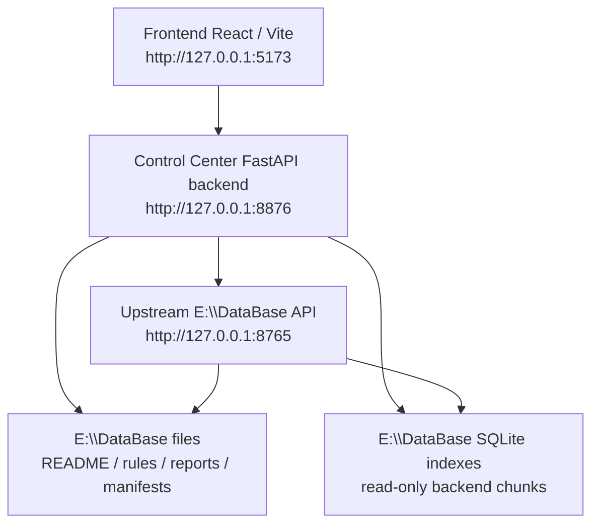

# Personal AI Database Control Center

**Status:** V1.2 GitHub presentation polish complete · V1.1 UI refinement complete · Read-only by default

Personal AI Database Control Center is a full-stack dashboard for browsing, searching, and generating task briefs from a local personal AI knowledge database.

个人 AI 知识库检索与管理控制台，用于查看本地知识库状态、搜索多领域知识、浏览报告，并为 Codex / opencode / Claude Code 等 AI Agent 生成任务 Brief。

This is an independent project. It is **not** the `E:\DataBase` repository itself.

## Why This Project Exists

Local AI knowledge bases are useful only when agents and humans can quickly inspect what is available, retrieve the right domain knowledge, and turn that context into actionable task briefs.

This project provides a small, practical control center over a local database:

- Human-friendly dashboard for database and domain status.
- Unified search surface over backend and other knowledge domains.
- Report and rule browsing for backend engineering knowledge.
- Brief generation for AI coding agents.
- Safe read-only integration with the existing `E:\DataBase` runtime.

## Features

- Multi-domain status dashboard.
- Backend knowledge search.
- Knowledge domain browser.
- Report viewer.
- Brief generator for AI coding agents.
- Agent Handoff Markdown export for Codex, opencode, and Claude Code.
- Read-only access to `E:\DataBase`.
- Upstream API proxy to `http://127.0.0.1:8765`.
- Safe fallback to local manifests and SQLite read-only query.
- React + FastAPI full-stack structure.
- V1.1 light SaaS-style frontend with Search / Reports / Brief UX fixes.

## Screenshots

Screenshots are stored in [`docs/screenshots`](docs/screenshots).

### Dashboard


### Search


### Reports


### Brief


### Backend Knowledge


### Domains


## Architecture



The control center backend is the safety boundary. The frontend does not read local files directly.

## Tech Stack

Backend:

- Python
- FastAPI
- Pydantic
- `pathlib`
- `sqlite3` read-only connections
- `urllib.request` for upstream API calls

Frontend:

- React
- Vite
- Native CSS
- Fetch API

Tooling:

- `npm run build`
- `python scripts/validate_project.py`
- `git diff --check`

## Quick Start

There are three services to understand.

### 1. Start `E:\DataBase` upstream API on port 8765

```powershell
cd E:\DataBase\backend_api
python -m uvicorn app.main:app --host 127.0.0.1 --port 8765
```

The control center can still read some local files when this upstream API is unavailable, but `/brief` works best when the upstream API is running.

### 2. Start the control center backend on port 8876

```powershell
cd E:\Projects\personal-ai-db-control-center\backend
python -m venv .venv
.\.venv\Scripts\pip install -r requirements.txt
.\.venv\Scripts\python -m uvicorn app.main:app --host 127.0.0.1 --port 8876
```

### 3. Start the frontend on port 5173

```powershell
cd E:\Projects\personal-ai-db-control-center\frontend
npm install
npm run dev
```

Open:

```text
http://127.0.0.1:5173
```

The frontend API base defaults to:

```text
http://127.0.0.1:8876
```

You can override it with `VITE_API_BASE`.

## Backend API Endpoints

All project endpoints use a unified response shape:

```json
{
  "ok": true,
  "data": {},
  "error": null,
  "request_id": ""
}
```

Implemented endpoints:

- `GET /health`
- `GET /domains`
- `GET /domains/{domain}/status`
- `GET /search?domain=backend&q=JWT%20RBAC&limit=5`
- `POST /brief`
- `GET /reports?domain=backend`
- `GET /reports/{domain}/{report_name}`
- `GET /backend/files?type=rules`
- `GET /backend/chunks/{chunk_id}`

See [`docs/API.md`](docs/API.md) for the API reference.

## Frontend Pages

- **Dashboard**: database root status, upstream API status, backend chunk counts, domain overview, recent reports.
- **Domains**: allowed domains, available sources, operations, and domain status details.
- **Search**: domain-aware search with usage hints, ranking detail viewer, and Agent Handoff Markdown export.
- **Backend Knowledge**: browser for backend rules, topics, patterns, checklists, templates, references, and reports.
- **Reports**: report list and scrollable report reader.
- **Brief**: task prompt, retrieval limits, returned chunks, final handoff, folded debug output, and copy/download agent handoff export.

## How It Uses `E:\DataBase`

The project uses `E:\DataBase` as a read-only knowledge source:

- Calls the upstream API at `http://127.0.0.1:8765` for database health, backend search, and brief generation.
- Reads domain metadata, rules, reports, README files, and manifests through allowlisted paths.
- Reads backend chunks from `E:\DataBase\runtime\db\sqlite\backend\backend_references.db` using SQLite read-only mode.
- Falls back to local files and read-only SQLite query when the upstream API is unavailable.
- Does not copy database files into this project.

## Safety Boundaries

This repository is intentionally conservative:

- This project is independent from `E:\DataBase`.
- It does not modify `E:\DataBase`.
- It does not modify `E:\DataBase\backend_api`.
- It does not rebuild indexes.
- It does not clear SQLite tables.
- It does not write to `runtime/db`.
- It is read-only by default.
- It should not store secrets.
- `.env.example` must only contain placeholders.
- It does not provide delete, write, reindex, or migration endpoints.

## Validation

Current validation commands:

```powershell
cd E:\Projects\personal-ai-db-control-center
python scripts\validate_project.py
git diff --check
```

Frontend production build:

```powershell
cd E:\Projects\personal-ai-db-control-center\frontend
npm run build
```

V1.2 README polish is documentation-only, so no backend `py_compile` or frontend build is required unless code changes are introduced.

## Project Structure

```text
personal-ai-db-control-center/
  backend/
    app/
      core/
      routers/
      schemas/
      services/
    requirements.txt
    README.md
  frontend/
    src/
      components/
      pages/
      api.js
      styles.css
    package.json
    README.md
  docs/
    API.md
    screenshots/
  scripts/
    validate_project.py
  PROJECT_REPORT.md
  TASK_MEMORY.md
  README.md
```

## Roadmap

- **V1.1:** UI refinement and UX fixes completed.
- **V1.2:** GitHub presentation polish / README / screenshots.
- **V1.3:** Search weighting optimization.
- **V1.4:** Read-only frontend detail viewer improvements.
- **V1.5:** Agent Handoff Markdown export for Search and Brief.
- **V1.6:** Optional token authentication and standardized handoff payload refinements.

## Resume Description

中文：

基于 FastAPI 与 React 构建个人 AI 知识库检索与管理控制台，实现多领域知识库状态监控、统一搜索、任务 Brief 生成、报告浏览和后端知识规则召回，为 Codex、opencode、Claude Code 等 AI Agent 提供结构化上下文支持。

English:

A full-stack dashboard built with FastAPI and React for managing a local personal AI knowledge database, supporting domain status inspection, unified search, report browsing, and task brief generation for AI coding agents.

## License / Notes

This project is currently a personal local tool and portfolio project.

No real secrets, private keys, JWT secrets, database passwords, or production credentials should be committed. Keep local database artifacts and runtime indexes in `E:\DataBase`; this repository should remain a separate read-only control center.
